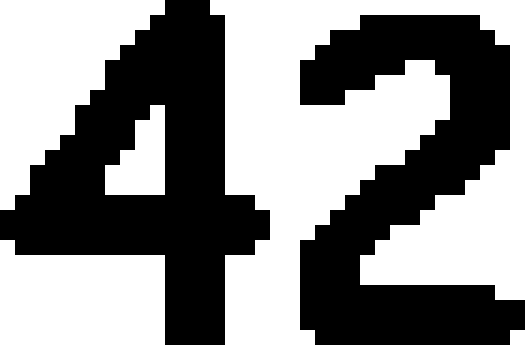
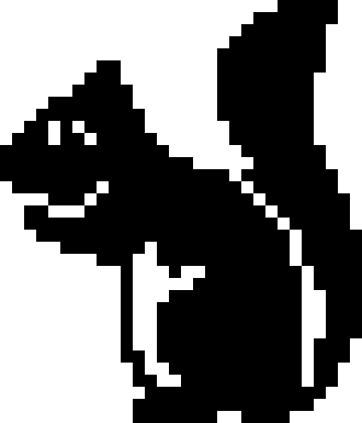
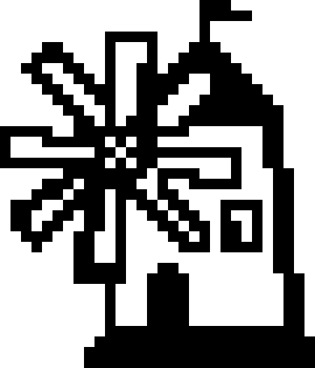
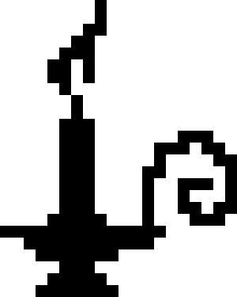
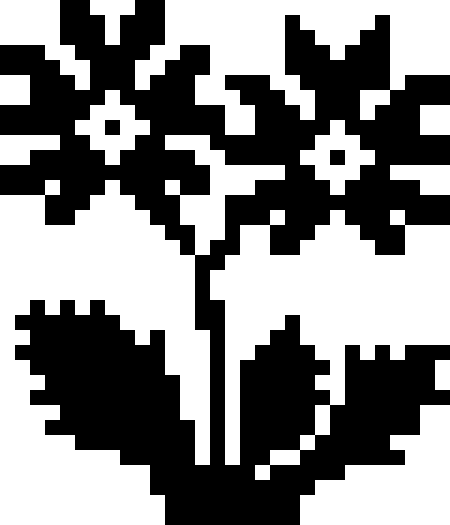

# Informe III: SAT y Nonogramas

## Integrantes

* Christian Oliveros 13-11000
* Yuni Quintero 14-10880

## Cómo correr

```python3 main.py ENCODING GLUCOSE_PATH NON_PATH_NO_EXT PPM_PATH_WITH_EXT```

Donde:

* ENCODING: 0 para Cuadrátrico, 1 para Heule y 2 para Logarítmico
* GLUCOSE_PATH: es el path al ejecutable de glucosa a utilizar
* NON_PATH_NO_EXT: es el path al nonograma a resolver, sin la extensión .non
* PPM_PATH_WITH_EXT: es el path donde se colocará el output en formato ppm, requiere la extensión .ppm

Se recomienda utilizar ```convert -resize 1500% -filter point XX.ppm XX.png``` para poder convertir las imágenes de PPM a PNG en un tamaño visible.

## Resultados

| Nonograma / Metodos |      Heule      |        Logarítmico       |
|:--------:|:------------------:|:------------------:|
|     42    | Number of variables: 41725, Number of clauses: 145082, Parse time: 0.06 s, CPU time: 0.227164 s  | Number of variables: 22381, Number of clauses: 400274, Parse time: 0.11 s, CPU time: 0.484654 s |
|     94    | Number of variables: 64042, Number of clauses: 272326, Parse time: 0.07 s, CPU time: 2.98074 s | Number of variables: 34070, Number of clauses: 702602, Parse time: 0.15 s, CPU time: 2.77456 s |
|     101    | Number of variables: 65158, Number of clauses: 282398, Parse time: 0.08 s, CPU time: 8.6085 s | Number of variables: 34655, Number of clauses: 720297, Parse time: 0.14 s, CPU time: 6.65835 s |
|     108    | Number of variables: 70862, Number of clauses: 249122, Parse time: 0.09 s, CPU time: 2.76593 s | Number of variables: 37645, Number of clauses: 725983, Parse time: 0.17 s, CPU time: 3.01649 s |
|     123    | Number of variables: 57098, Number of clauses: 229510, Parse time: 0.08 s, CPU time: 2.69878 s | Number of variables: 30430, Number of clauses: 612354, Parse time: 0.15 s, CPU time: 2.25568 s |
|     133    | Number of variables: 55362, Number of clauses: 264290, Parse time: 0.07 s, CPU time: 11.1493 s | Number of variables: 29520, Number of clauses: 635276, Parse time: 0.15 s, CPU time: 6.65395 s |
|     candle    | Number of variables: 11000, Number of clauses: 39726, Parse time: 0.01 s, CPU time: 0.071557 s | Number of variables: 6125, Number of clauses: 85601, Parse time: 0.02 s, CPU time: 0.136054 s |
|     flower    | Number of variables: 63174, Number of clauses: 279998, Parse time: 0.10 s, CPU time: 84.9547 s | Number of variables: 33615, Number of clauses: 704345, Parse time: 0.15 s, CPU time: 98.2905 s |

Se puede observar que el metodo Heule da mejores resultados que el Logarítmico con especto a parse time. Por otro lado, Heule utiliza una mayor cantidad de variables a cambio de utilizar menos clausulas, lo que justamente agiliza el parsing. Pero esto no parece mejorar siempre el CPU Time, el cuál alterna entre Heule y Logarítmico en los nonogramas probados.

Otro punto que es importante destacar es que los nonogramas meow, sun, 529 y tiger no se pudieron completar luego de más de 8 horas de corrida. Suponemos que esto ocurrió debido a la gran cantidad de cláusulas, normalmente cercana a 1 millón, y la gran cantidad de variables, normalmente alrededor a 500.000.
